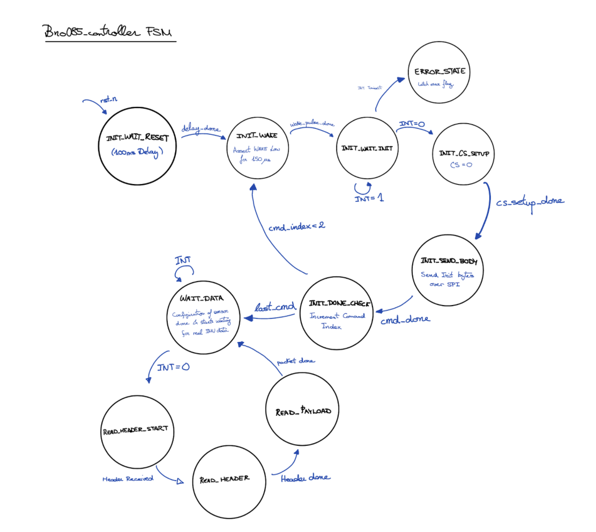

## FPGA-Based BNO085 SHTP Driver (Initial Implementation)

Before transitioning to the final ESP32-assisted architecture, we developed a fully-hardware BNO085 driver implemented directly on the FPGA. The goal of this approach was to remove the dependency on the Adafruit software libraries and have the FPGA manage all communication with the BNO085 over SPI.

### A.1 Purpose

This controller was designed to:

- Wake and configure the BNO085 sensor into SPI mode
- Send SHTP initialization commands to enable motion features
- Receive real-time motion data using the INT pin
- Decode Rotation Vector (quaternion) and Calibrated Gyroscope reports entirely in hardware

### A.2 Replacing the Adafruit Library in Hardware
In a standard microcontroller implementation, the Adafruit BNO085 library handles:

- Device wake-up and handshake
- SH-2 Set Feature commands
- SHTP packet parsing and FIFO management

Our SystemVerilog module (bno085_controller.sv) replicated these responsibilities using a finite state machine:

### A.3 Normal Operation

Once initialized, the FSM:

1. Waits for INT to assert low
2. Reads the SHTP header to determine channel and packet size
3. Parses sensor payload bytes as they arrive over SPI
4. Produces validated motion data outputs: 

        - Quaternion: quat_w, quat_x, quat_y, quat_z  
        - Gyroscope:  gyro_x, gyro_y, gyro_z  		
        - Strobes:    quat_valid, gyro_valid

{width=80% .center}

&nbsp;

## SPI Signal Verification via Logic Analyzer

To verify that the bno085_controller FSM behaved correctly in hardware, we captured SPI traffic between the FPGA and the BNO085 sensor using a Saleae logic analyzer. The channel mapping is given in Table X.

&nbsp;

**Table X: Logic Analyzer Channel Assignments**

| Channel | Signal | Description                                           |
|:------:|:------:|-------------------------------------------------------|
| D2     | MOSI   | FPGA → BNO085 SPI transmit data                       |
| D3     | CS     | Chip Select (active low)                               |
| D5     | INT    | Sensor interrupt indicating data-ready (active low)    |

&nbsp;

1. CS asserts low: Corresponds to INIT_CS_SETUP and INIT_SEND_BODY, where the FPGA begins sending the initialization command packet.
2. MOSI shows valid outgoing bytes: These are the Set Feature SHTP command bytes generated by get_init_byte() inside the FSM.
3. INT remains high during sensor wake/reset:Indicates the BNO085 has not yet completed boot and is not ready to provide data.
4. INT transitions low after configuration: Triggers exit from INIT_DONE_CHECK into WAIT_DATA, confirming the sensor is now fully configured and operational.

This capture validates that the FPGA FSM implements the expected initialization handshake and SPI timing, successfully transitioning the BNO085 into normal data-output mode.
