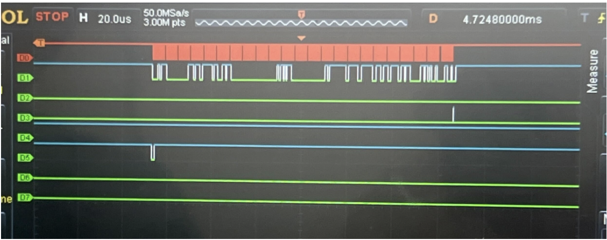

Initially, we attempted to configure the BNO085 sensors directly from the FPGA using a 11-state finite state machine (FSM) with encoding logic implemented using DSP blocks and BRAM (Block RAM) resources. This approach aimed to handle the Sensor Hub Transport Protocol (SHTP) communication directly on the FPGA, including sensor initialization, command encoding, and data packet parsing. While this implementation successfully extracted data from the sensors (as shown in Figure X), the approach proved unreliable in practice. For more information on the developed of the SHTP protocol on the FPGA, please refer to Appendix A.

The system experienced inconsistent connection behavior, with data transmission failures and intermittent communication errors that prevented stable operation. The complexity of managing SHTP protocol timing, interrupt handling, and state transitions at the hardware level made it difficult to achieve the reliability required for real-time drum triggering.

Given the reliability challenges with the FPGA-based sensor configuration, we transitioned to a more reliable hybrid architecture that leverages the strengths of each component: 

1. Arduino ESP32: Handles sensor configuration and data acquisition using the mature Adafruit_BNO08x library, which provides robust SHTP protocol handling and reliable sensor communication over I²C. This approach proved significantly more reliable than the FPGA-based sensor configuration. 

2. FPGA: Receives pre-processed sensor data from the Arduino via SPI and packages it into a custom transmission format optimized for the MCU interface. The FPGA's role shifted from sensor management to efficient data packaging and routing. 

3. STM32 MCU: Decodes the packaged data packets from the FPGA, identifies drum triggers based on gesture patterns, and outputs audio samples through the DAC to drive the speaker. This transition to using Arduino for sensor data acquisition and FPGA for data packaging provided the reliability and consistency needed for real-time operation, while maintaining the FPGA's role in efficient data processing and the MCU's role in audio playback.

On Figure X, you can see the final FPGA top module connecting the Arduino and MCU through two SPI protocols after packaging the data for the MCU. drum_trigger_top.sv instantiates two submodules that handle the SPI interfaces on each side: arduino_spi_slave_init.sv, which implements the SPI Mode 0 slave interface to the Arduino by receiving 16-byte raw sensor packets, shifting the data in during each SCK rising edge, synchronizing it into the FPGA clock domain, validating the header byte, and exposing a stable packet buffer for downstream processing; and spi_slave_mcu.sv, which acts as a read-only SPI Mode 0 slave to the MCU, outputting those 16-byte packets on MISO as the MCU generates dummy clock cycles, enabling direct transfer of the synchronized sensor data to the MCU for parsing and drum-trigger computation. The code can be found here:   
https://github.com/stremme1/E155_Final_SPI_Test/tree/main/fpga
