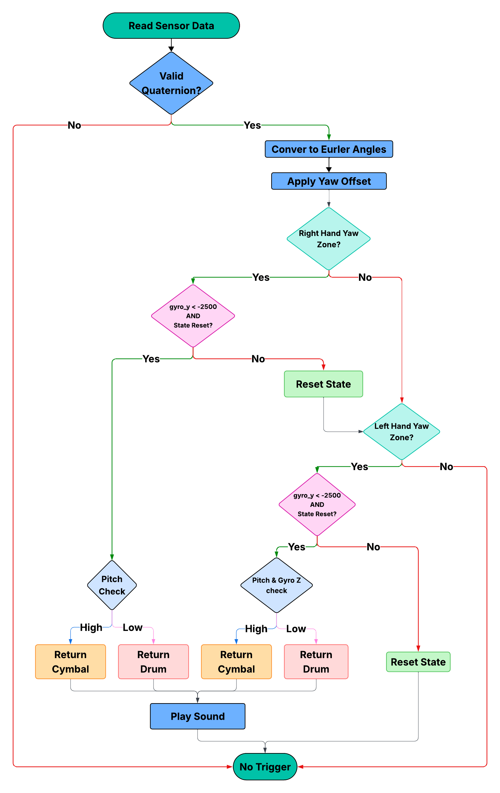
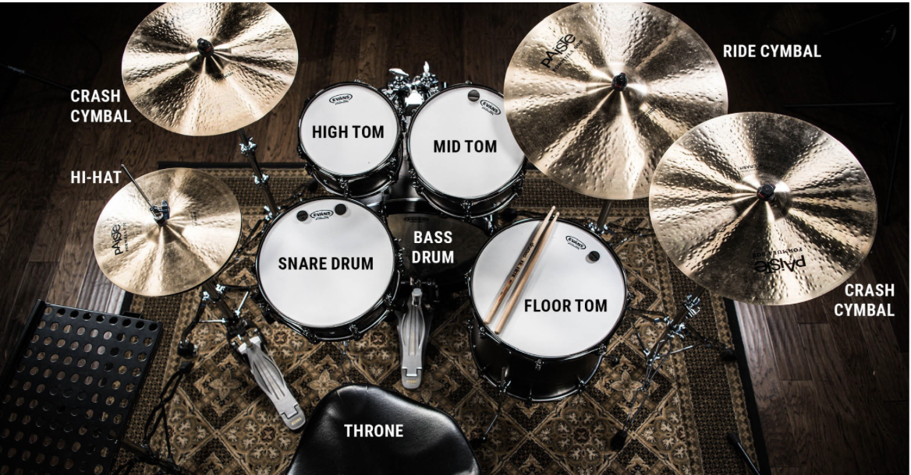

Decodes the packaged data packets from the FPGA, identifies drum triggers based on gesture patterns, and outputs audio samples through the DAC to drive the speaker. This transition to using Arduino for sensor data acquisition and FPGA for data packaging provided the reliability and consistency needed for real-time operation, while maintaining the FPGA's role in efficient data processing and the MCU's role in audio playback.

## MCU Runtime Flow

&nbsp;

### Main Application Files
This section contains the entry points for the system and the logic for the main control loops.

- main.c: Main entry point for dual-hand drum trigger system. Initializes hardware (DAC, SPI, buttons), reads sensor data from SPI, processes both sensors, and plays drum sounds when triggers detected.
- main_left.c: Single-hand version processing only left hand sensor. Uses left-hand-only detection logic for simplified testing.
- main_right.c: Single-hand version processing only right hand sensor. Uses right-hand-only detection logic for simplified testing.

### Detection Logic
Files responsible for interpreting sensor data against the drum zone map.

- drum_detector.c Core drum trigger detection using yaw zones, pitch thresholds, and gyroscope readings. Checks both sensors against predefined zones and returns drum codes (0x00-0x07) when strike conditions met.

The following logic pertantes to each left and right hand sensor: 

Table: Drum Trigger Mapping Logic Based on Orientation and Motion

| Code | Instrument | Hand   | Yaw Range (°)    | Pitch / Condition                      | Gyro Y       | Gyro Z       |
|:----:|:----------:|:------:|:-----------------|:---------------------------------------|:------------:|:------------:|
| 0x00 | SNARE      | Right  | 20° – 120°       | Any                                    | < -2500      | Any          |
| 0x00 | SNARE      | Left   | 350° – 100°      | ≤ 30° OR Gyro Z ≤ -2000                | < -2500      | Any          |
| 0x01 | HIHAT      | Left   | 350° – 100°      | > 30°                                  | < -2500      | > -2000      |
| 0x02 | KICK       | Button | N/A              | N/A                                    | N/A          | N/A          |
| 0x03 | HIGH_TOM   | Right  | 340° – 20°       | ≤ 50°                                  | < -2500      | Any          |
| 0x03 | HIGH_TOM   | Left   | 325° – 350°      | ≤ 50°                                  | < -2500      | Any          |
| 0x04 | MID_TOM    | Right  | 305° – 340°      | ≤ 50°                                  | < -2500      | Any          |
| 0x04 | MID_TOM    | Left   | 300° – 325°      | ≤ 50°                                  | < -2500      | Any          |
| 0x05 | CRASH      | Right  | 340° – 20°       | > 50°                                  | < -2500      | Any          |
| 0x05 | CRASH      | Left   | 325° – 350°      | > 50°                                  | < -2500      | Any          |
| 0x06 | RIDE       | Right  | 305° – 340°      | > 50°                                  | < -2500      | Any          |
| 0x06 | RIDE       | Right  | 200° – 305°      | > 30°                                  | < -2500      | Any          |
| 0x06 | RIDE       | Left   | 300° – 325°      | > 50°                                  | < -2500      | Any          |
| 0x06 | RIDE       | Left   | 200° – 300°      | > 30°                                  | < -2500      | Any          |
| 0x07 | FLOOR_TOM  | Right  | 200° – 305°      | ≤ 30°                                  | < -2500      | Any          |
| 0x07 | FLOOR_TOM  | Left   | 200° – 300°      | ≤ 30°                                  | < -2500      | Any          |

&nbsp;

### Sensor Processing

- bno085_decoder.c: Converts BNO085 quaternion data (Q14 format) to Euler angles (roll, pitch, yaw). Normalizes yaw to 0-360° range for zone checking.

### Audio Playback

- audio_player.c: Maps drum codes to WAV sample arrays and plays sounds via DAC. Prevents overlapping playback using is_playing flag.

### Hardware Abstraction Layer (STM32L432KC)

Low-level drivers for peripheral configuration and control.

- STM32L432KC_DAC.c: Configures DAC peripheral for audio output on PA4. Implements WAV playback using timer interrupts at specified sample rates.
- STM32L432KC_SPI.c: SPI slave mode communication to receive 16-byte sensor data packets from Arduino/ESP32 master. Parses quaternion and gyroscope data.
- STM32L432KC_USART.c: USART configuration for debug serial communication. Provides low-level byte/string transmission functions.
- STM32L432KC_GPIO.c: GPIO pin configuration and control. Implements pinMode(), digitalRead(), digitalWrite() for buttons and SPI pins.
- STM32L432KC_RCC.c: Clock configuration setting system clock to 80MHz. Enables peripheral clocks for GPIO, SPI, USART, DAC, and timers.
- STM32L432KC_FLASH.c: Flash memory configuration for 80MHz operation. Sets wait states and enables prefetch buffer.
- STM32L432KC_TIMER.c: Timer functions for delays. Implements ms_delay() for button debouncing and audio timing.

### Debug & Utilities

- debug_print.c Debug logging using USART with printf-style formatting. Used for debugging sensor data and system state.
- wav_arrays/ Directory with WAV samples converted to C arrays. Contains all 8 drum samples as 16-bit PCM data.

## Technical Documentation

All code for MCU can be found on this [GitHub repository.](https://github.com/stremme1/E155_Final_SPI_Test/tree/main/mcu) 
