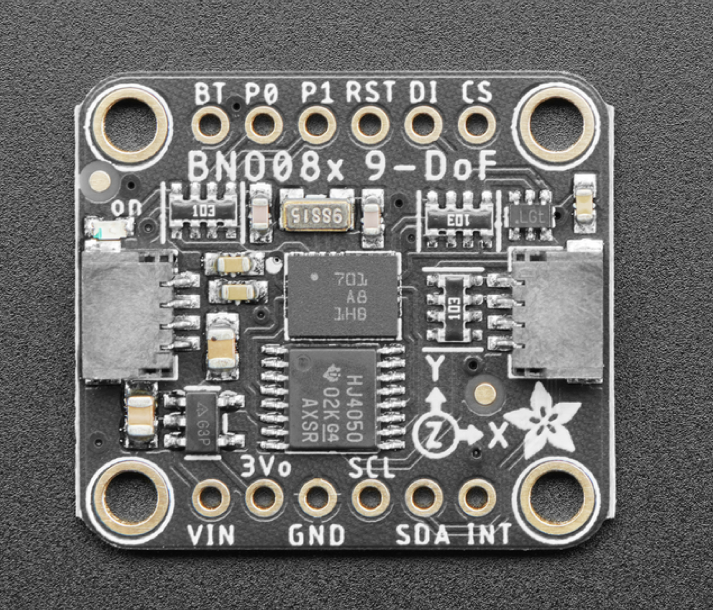
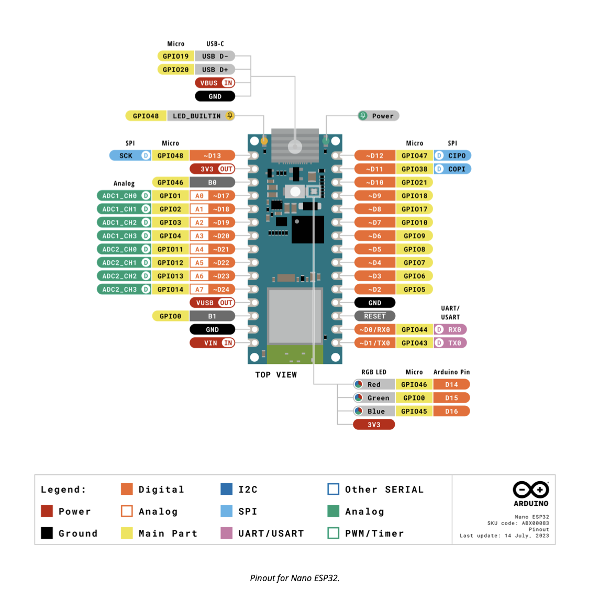

## BNO085 IMU: Sensor and Communication Protocol 

{width=65% .center}

The BNO085 is a 9-axis intelligent IMU that integrates an accelerometer, gyroscope, and magnetometer with an onboard sensor-fusion processor. Instead of exposing raw sensor registers directly, the BNO085 communicates through the Sensor Hub Transport Protocol (SHTP) — a structured, packet-based protocol that runs over standard physical interfaces including I²C, SPI, or UART, depending on the configuration of the protocol-select pins at startup.

SHTP organizes all communication into channels, each dedicated to a specific type of information. For example, there are channels for configuration commands, sensor data streams, and control/status messages. Each channel maintains its own sequence number, which ensures that the host can detect lost or out-of-order packets and reliably manage multiple data streams at once.

Each SHTP transmission consists of a packet header followed by a payload. The 4-byte header contains the total packet length (including header), the channel number, and the channel’s sequence number. The payload begins with a Report ID, which defines the type of data being transmitted, followed by the actual sensor data bytes. Depending on the enabled reports, this data may include raw motion readings or fully fused orientation outputs such as rotation vectors, quaternions, or yaw-pitch-roll angles. The BNO085 continually sends these report packets to the host at the configured update rate, allowing efficient and low-latency motion tracking without requiring any external fusion algorithms.

By using SHTP and a multi-channel packet architecture, the BNO085 provides robust and synchronized delivery of motion data, while offloading the heavy computational cost of sensor fusion from the host processor. This makes the sensor well-suited for high-performance embedded applications such as robotics, VR/AR motion controllers, and human-motion tracking systems.

The BNO085 contains an onboard MCU that runs embedded fusion firmware, enabling it to perform its own signal processing and generate orientation data autonomously.

- Inside the sensor package, there is an ARM Cortex-M0+ microcontroller running Bosch’s BSX Lite fusion firmware (or CEVA SH-2/SH-2A depending on version).
- This embedded software performs:

        - Sensor fusion (combining accel + gyro + mag)
        - Calibration and drift compensation
        - Report generation and timestamping
        - SHTP communication handling
This is why the BNO085 can output high-level motion data like quaternions and rotation vectors instead of only raw sensor values — the processing is already happening inside the chip.

More information on the SHTP protocol can be found in the [bno08x Data Sheet.](https://www.ceva-ip.com/wp-content/uploads/BNO080_085-Datasheet.pdf) 

[Bno085 Datasheet.](https://cdn-learn.adafruit.com/downloads/pdf/adafruit-9-dof-orientation-imu-fusion-breakout-bno085.pdf) 

&nbsp;

## Arduino ESP32: Interface and Library Integration

{width=70% .center}

To collect and process motion data from the BNO085 sensor, the system uses an Arduino Nano ESP32 as the host microcontroller. This board combines the ESP32-S3’s processing power with the ease of the Arduino ecosystem, while also providing integrated Wi-Fi and Bluetooth connectivity. Its larger memory capacity makes it well-suited for handling advanced sensor-fusion libraries.

To communicate with the IMU, the Arduino implements the Adafruit_BNO08x library, which provides a high-level application interface for the BNO085 sensor. Instead of requiring manual parsing of Sensor Hub Transport Protocol (SHTP) packets, the library abstracts low-level communication and directly exposes orientation and motion data in a structured format. Through simple API calls, the application can initialize the sensor, enable specific data reports, and retrieve quaternion or Euler-angle outputs with precise timestamps.

The communication between the Arduino ESP32 and the BNO085 uses the I²C protocol, following a typical configuration where SDA and SCL lines connect to the board’s dedicated I²C pins, and the device uses its default I²C address (0x4A). Once initialized with begin_I2C(), the system activates the desired sensor-fusion reports, such as the rotation vector, through enableReport(...). During runtime, calls to functions like getSensorEvent(...) return the latest fused motion data, processed internally by the sensor’s onboard firmware.

Together, the Arduino Nano ESP32 platform and the Adafruit_BNO08x library provide a compact and efficient solution for retrieving motion-tracking information from the BNO085, while minimizing implementation complexity and host processing requirements.

[Arduino Esp32 Datasheet.](https://docs.arduino.cc/resources/datasheets/ABX00083-datasheet.pdf) 

[Adafruit_BNO08x library](https://github.com/adafruit/Adafruit_BNO08x) 

