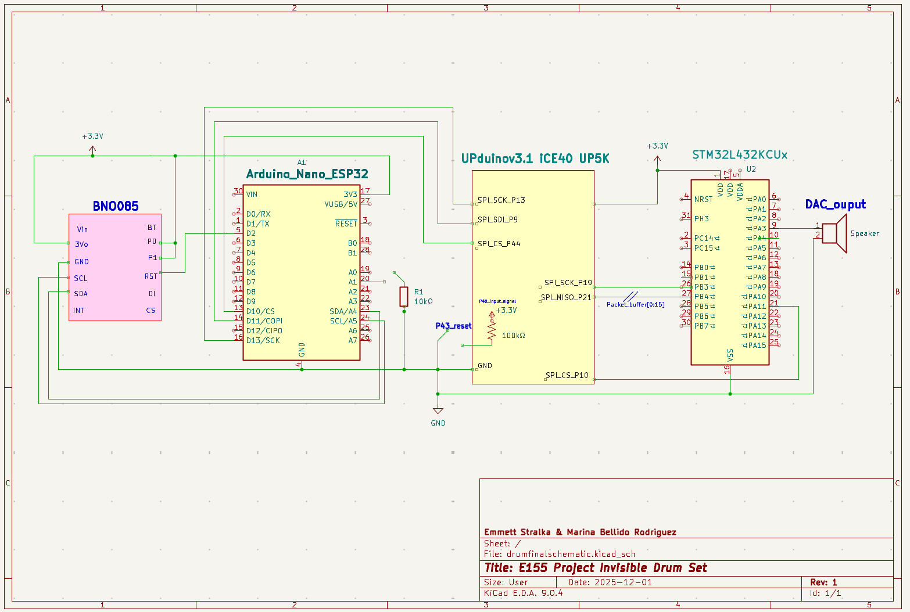
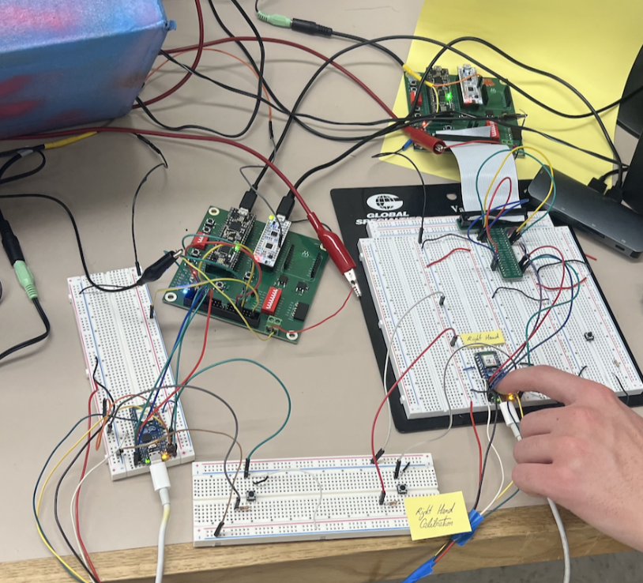
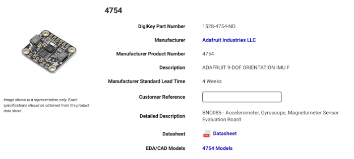

Each drumstick is designed as a fully independent embedded system, containing its own BNO085 sensor, Arduino Nano ESP32, FPGA, and STM32 microcontroller. This distributed architecture ensures that the left and right sticks remain electrically and logically isolated — improving robustness, reducing latency, and making the system scalable to additional sticks in the future.

The data pipeline in each stick relies on multiple communication protocols between its hardware components. The BNO085 sensor communicates with the Arduino Nano ESP32 using the I²C protocol, with the high-level SHTP protocol layered on top to enable structured transfer of fused motion data. Once the sensor data is received by the ESP32, it is forwarded to the FPGA over an SPI interface, where the FPGA operates as the SPI slave and the ESP32 serves as the SPI master. On the FPGA, the data is Package into a custom packet format and relayed to the MCU for trigger processing.
From there, the FPGA sends the  packaged data to the STM32 microcontroller through a second SPI link, again with the FPGA acting as the slave and the STM32 as the master. The microcontroller performs gesture recognition to detect drumming motions, and the resulting sound IDs (0–7) are output through a digital-to-analog converter (DAC) to drive a speaker that plays the correct drum sound.

### Files responsible for FPGA packaging: 
- drum_trigger_top.sv: Top-level module that connects the two SPI slaves. Instantiates arduino_spi_slave and spi_slave_mcu, passing the packet buffer from Arduino to MCU.
- arduino_spi_slave.sv: Receives 16-byte packets from Arduino via SPI. Buffers the packet and converts components from Quaternion to Euler Conversion with DSP multipliers (Header, Roll, Pitch, Yaw, Gyro X/Y/Z, Flags) and synchronizes it to the FPGA clock domain. 
- spi_slave_mcu.sv: Sends the packet buffer to the MCU via SPI. Acts as an SPI slave to the MCU, shifting out the 16-byte packet buffer byte-by-byte when the MCU requests data. 

&nbsp;

**Table 1: Sensor Data Packet Byte Map**

|       Bytes	                 |  Information                   | 
|--------------------------------|--------------------------------|
|          0                     |    Header (0xAA)               |   
|          1-2                   |    Roll (int16_t, MSB first) - Euler angle scaled by 100            |    
|          3-4                   |    Pitch (int16_t, MSB first) - Euler angle scaled by 100           |   
|          5-6                   |    Yaw (int16_t, MSB first) - Euler angle scaled by 100             |    
|          7-8                   |    Gyro X (int16_t, MSB first) - scaled by 2000                     |    
|          9-10                  |    Gyro Y (int16_t, MSB first) - scaled by 2000                     |   
|          11-12                 |    Gyro Z (int16_t, MSB first) - scaled by 2000                     |
|          13                    |    Flags (bit 0 = Euler valid, bit 1 = Gyro valid)                  |
|          14-15                 |    Reserved (0x00)                                                  |

&nbsp;

This multi-protocol, distributed architecture enables reliable motion data transfer across all processing elements in each stick. The correct functionality of each communication stage is demonstrated in the Results section of this report. 

The schematic system is shown in Figure 1, and Figure 2 illustrates the complete dual-stick embedded prototype during testing.

&nbsp;

{width=80% .center}

&nbsp;

## GITHUB CODE:
COMPELTE!!!!!

&nbsp;

## Bill of Materials

The project was given a budget of $50, and the Bill of Materials below show how that budget was allocated.

&nbsp;

**Table 2: Bill of Materials Breakdown**

| Material / Part               | Quantity | Unit Cost | Total Cost |
|------------------------------|:--------:|:---------:|-----------:|
| BNO055 IMU Sensors           |    2     | \$24.95    | \$49.90    |
| Speaker (8Ω, 4W)             |    1     | Stockroom  | \$0.00     |
| Drum Switches                |    2     | Stockroom  | \$0.00     |
| Potentiometer                |    1     | Stockroom  | \$0.00     |
| SD Card                      |    1     | Stockroom  | \$0.00     |
| **Total**                    |          |           | **\$49.90** |

{width=80% .center}
