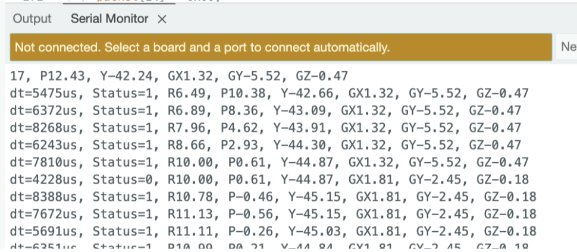
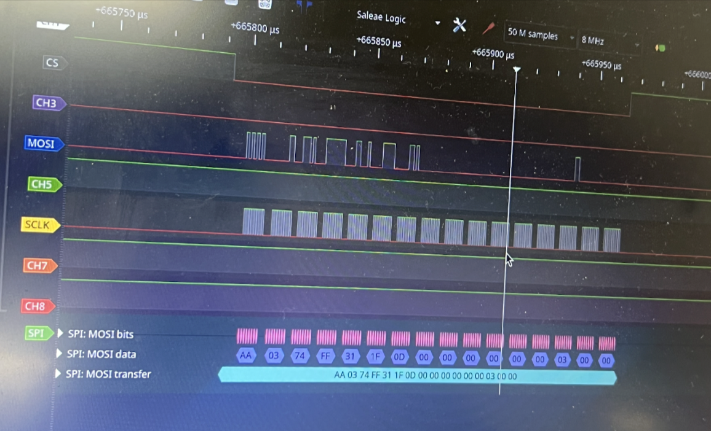
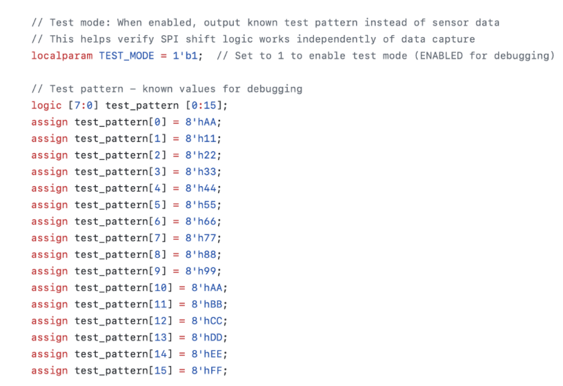
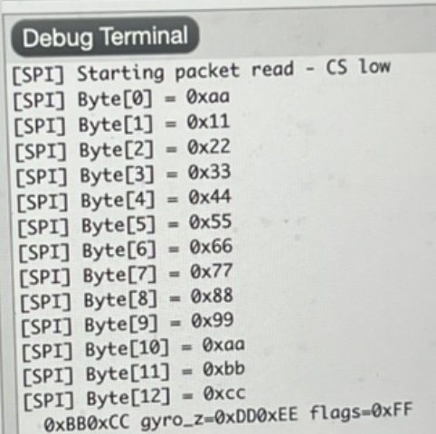
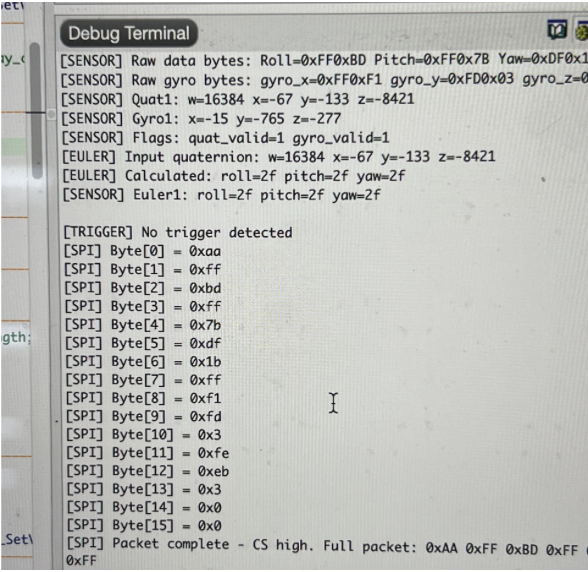
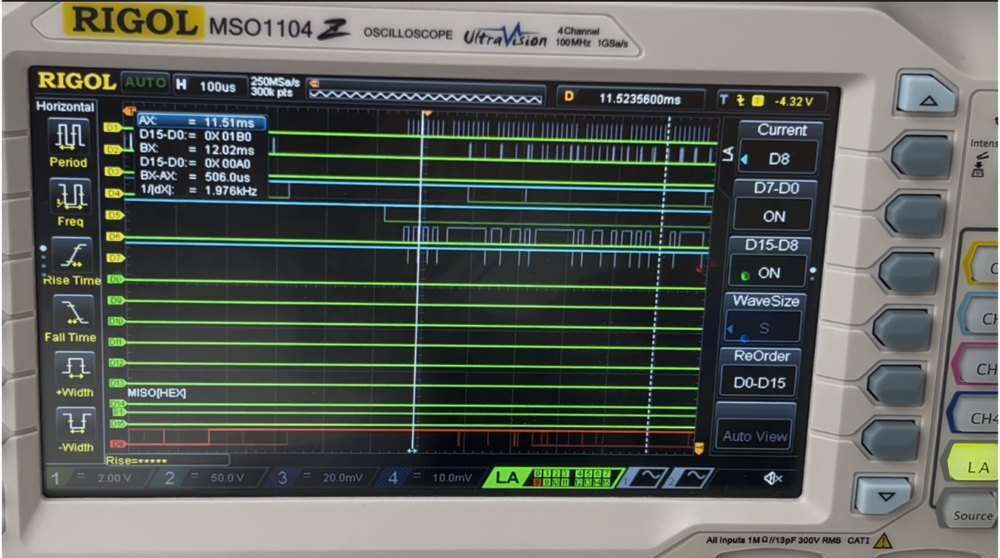
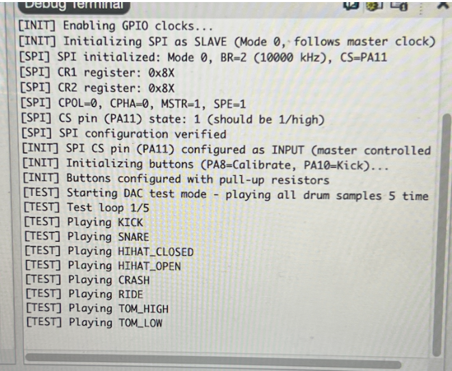

## Working protocols 

&nbsp;

### I2C Data Transmission between BNO085 - Arduino: 

Before validating the SPI interface, the correct operation of the BNO085 sensor stream was confirmed using the Arduino Serial Monitor. As shown in Figure X, the Arduino receives fused motion data from SHTP Channel 2, including Euler angles and gyroscope measurements. The reported Status = 1 confirms valid quaternion and gyro results, while the dt field demonstrates a stable sampling interval. This establishes that the sensor is configured correctly prior to forwarding data over SPI.

{width=70% .center}

&nbsp;

### SPI Data Transmission between ESP32 - FPGA: Validation Using Logic Analyzer:

To verify correct data transfer between the Arduino ESP32 and the FPGA, the SPI bus was monitored using a logic analyzer. The captured waveform confirms that the expected byte sequence is transmitted from the Arduino to the FPGA when new motion data is available.
In the SPI trace, the Chip Select (CS) line goes low to initiate communication, and the Serial Clock (SCLK) drives the shifting of bits on the MOSI line. The logic analyzer successfully decodes the transmitted bytes, showing the correct formatting of the motion-data packet. The packet begins with the synchronization header 0xAA, followed by three 16-bit signed values corresponding to the Euler angles (roll, pitch, yaw), encoded in MSB-first two’s-complement representation:

{width=70% .center}

Table: Sensor Data Packet Byte Map

| Parameter | Raw Bytes (Hex, 2’s Complement) | Value (Decimal) | Interpretation |
|-----------|--------------------------------|-----------------|----------------|
| Header    | `AA`                           | —               | Packet start marker |
| Roll      | `03 74`                        | 884             | ~88.4° (÷10) |
| Pitch     | `FF 31`                        | –207            | ~–20.7° (÷10) |
| Yaw       | `1F 0D`                        | 7949            | ~794.9° (wrap correction later) |

&nbsp;

This successful logic-level validation demonstrates that:

- The decoded values shown in the logic analyzer match the same roll, pitch, and yaw values printed in the Arduino serial monitor, confirming full consistency between software-level and wire-level communication.
- The SPI protocol is functioning correctly.
- The data formatting (header + signed angle values) matches the intended system design.

This result confirms that the Arduino-to-FPGA stage of the communication pipeline is reliable, and it establishes confidence in the real-time transmission path used in the complete system.

&nbsp;

### SPI Data Transmission between FPGA - MCU: Validation Using Logic Analyzer:

To verify correct data transfer between the FPGA and the mcu, the SPI bus was monitored using a test_bench and a logic analyzer. As we can observe in Figure X we added a test pattern in module spi_slave_mcu.sv and then we can observe how that same packet was transmitted correctly in the mcu segger debug terminal. This shows that the spi protocol works correctly.

{width=70% .center}

{width=40% .center}

As shown in Figure X, the MCU successfully receives the formatted 16-byte packets transmitted through the FPGA. These packets originate from SHTP  Channel 2, which is the dedicated fused-sensor data stream of the BNO085. The Arduino firmware parses the incoming SHTP frames and extracts only the motion-tracking payload, removing the original SHTP header before re-packaging the data for SPI transmission. Each packet begins with a synchronization header byte (0xAA), followed by fused orientation and inertial measurements encoded as signed 16-bit integers (MSB-first). A status/flags byte indicates data validity, and two trailing bytes are reserved for potential future use. This structure allows the MCU to efficiently decode motion data in real time while ensuring reliable packet boundary detection. Table X, explains in more detail each byte transferred.

{width=50% .center}

Table: Packet Byte Definitions

|       Bytes	                 |  Information                   | 
|--------------------------------|--------------------------------|
|          0                     |    Header (0xAA)               |   
|          1-2                   |    Roll (int16_t, MSB first) - Euler angle scaled by 100            |    
|          3-4                   |    Pitch (int16_t, MSB first) - Euler angle scaled by 100           |   
|          5-6                   |    Yaw (int16_t, MSB first) - Euler angle scaled by 100             |    
|          7-8                   |    Gyro X (int16_t, MSB first) - scaled by 2000                     |    
|          9-10                  |    Gyro Y (int16_t, MSB first) - scaled by 2000                     |   
|          11-12                 |    Gyro Z (int16_t, MSB first) - scaled by 2000                     |
|          13                    |    Flags (bit 0 = Euler valid, bit 1 = Gyro valid)                  |
|          14-15                 |    Reserved (0x00)                                                  |

&nbsp;

Custom 16-byte SPI packet structure used for transmitting fused orientation and inertial data from the Arduino through the FPGA to the MCU. The packet includes a 0xAA synchronization header followed by sensor measurements and status information extracted from SHTP Channel 2 reports.

{width=70% .center}

&nbsp;

### DAC Working:

To verify audio output capability and confirm correct DAC initialization, the MCU firmware begins by sequentially playing each stored drum sample at startup. As shown in Figure X, the debug log confirms successful SPI configuration, DAC activation, and playback of all seven drum sounds (Kick, Snare, Hi-Hat Closed, Hi-Hat Open, Crash, Ride, Tom High, Tom Low). This provides a functional baseline test proving that the audio subsystem is fully operational before real-time trigger detection begins.

{width=70% .center}
