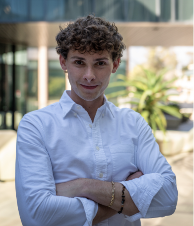

## Meet the Team

### Emmet Stralka

Harvey Mudd College student majoring in Engineering and Economics with hands-on experience in ML/AI product management at Apple and Ford Motor Company. Expertise in embedded systems, data science, and cross-functional product development.

  <a href="https://www.linkedin.com/in/emmett-stralka-b41575213/"
     style="display:inline-flex; align-items:center; padding:6px 14px; border:1px solid #ccc; border-radius:8px; text-decoration:none; color:#333; margin-right:10px;">
    <i class="bi bi-linkedin" style="font-size:1.1rem; margin-right:6px;"></i>
    LinkedIn
  </a>
  <a href="https://github.com/stremme1"
     style="display:inline-flex; align-items:center; padding:6px 14px; border:1px solid #ccc; border-radius:8px; text-decoration:none; color:#333;">
    <i class="bi bi-github" style="font-size:1.1rem; margin-right:6px;"></i>
    Github
  </a>
  <a href="https://stremme1.github.io/E155-Website-Emmett_Stralka/"
     style="display:inline-flex; align-items:center; padding:6px 14px; border:1px solid #ccc; border-radius:8px; text-decoration:none; color:#333;">
    Website
  </a>

&nbsp;

### Marina Bellido

Harvey Mudd College student majoring in Engineering with experience in electrical and computer engineering/digital design. Currently doing research as a Clay-Wolkin Fellow at Harvey Mudd’s VLSI lab developing a comprehensive open-source functional verification suite for RISC-V processors. Experience with SystemVerilog and RISC-V assembly.

  <a href="in/marina-bellido-hmc"
     style="display:inline-flex; align-items:center; padding:6px 14px; border:1px solid #ccc; border-radius:8px; text-decoration:none; color:#333; margin-right:10px;">
    <i class="bi bi-linkedin" style="font-size:1.1rem; margin-right:6px;"></i>
    LinkedIn
  </a>
  <a href="https://github.com/Marina-Bellido"
     style="display:inline-flex; align-items:center; padding:6px 14px; border:1px solid #ccc; border-radius:8px; text-decoration:none; color:#333;">
    <i class="bi bi-github" style="font-size:1.1rem; margin-right:6px;"></i>
    Github
  </a>
  <a href="https://marina-bellido.github.io"
     style="display:inline-flex; align-items:center; padding:6px 14px; border:1px solid #ccc; border-radius:8px; text-decoration:none; color:#333;">
    Website
  </a>

