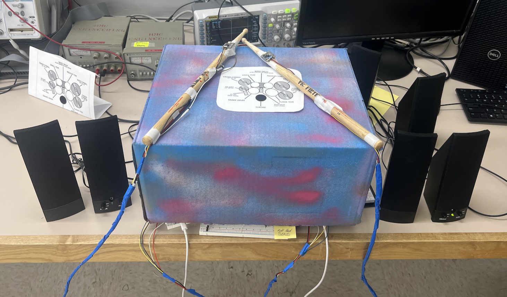

:::{.text-center}
](images/team.png){width=65% .center}
:::

## Abstract
This project aims to adapt the existing Invisible Drum Set—originally implemented with an Arduino Nano and BNO055 IMU sensor—onto the E155 hardware platform, consisting of an STM32 MCU and UPduino FPGA. It will enable playing virtual drums through air gestures detected by the IMU, with real-time audio synthesis and low latency. 

  
  

